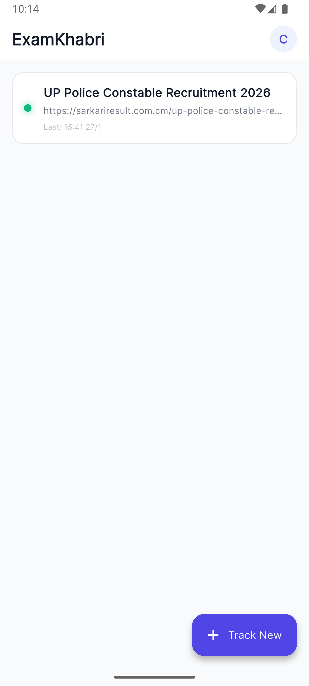
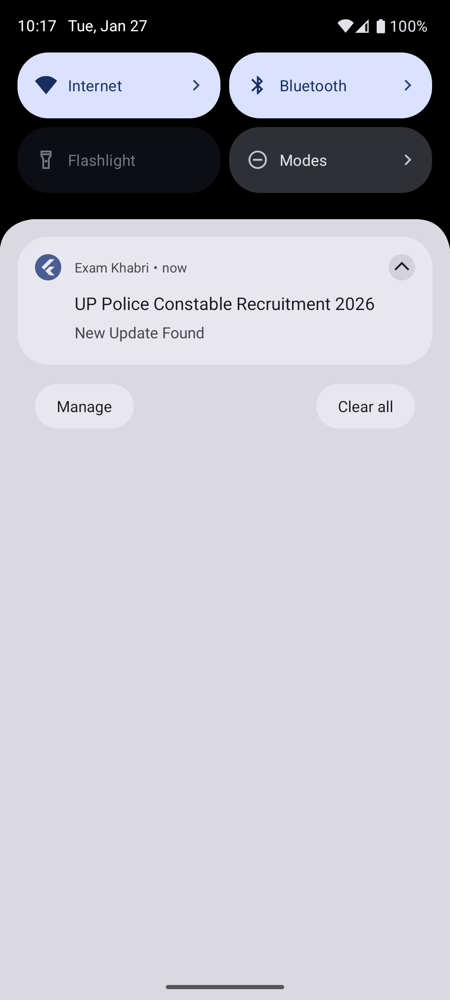

# 📢 Exam Khabri

> **Never miss an exam update again.**
> *A product by [Korexio]*

---

## 🚀 Overview

**Exam Khabri** is a smart utility app designed for Indian students preparing for competitive exams (SSC, UPSC, Banking, Railways). It solves the problem of manually checking multiple "Sarkari" websites every day.

Instead of wasting time refreshing pages, Exam Khabri uses an **intelligent cloud scraper** to monitor official sources and sends **instant push notifications** the moment a new Admit Card, Result, or Job Notification is released.

---

## ✨ Key Features

* **⚡ Real-Time Alerts:** Instant Push Notifications via Firebase Cloud Messaging (FCM).
* **🤖 Smart Scraping:** Custom Edge Functions that filter out "fake updates" (ads/timestamps) and only notify for real data changes.
* **🎯 Exam Specific Tracking:** Filters updates specifically for SSC, Railways, and Banking.
* **🌙 Dark Mode:** Fully optimized UI for night-time study sessions.
* **📱 Native Performance:** Built with Flutter for smooth 60fps performance on Android.

---

## 📸 Screenshots

| Dashboard | Updates Feed |
| :---: | :---: |
|  |  |

---

## 📥 Download & Install

You can download the latest version directly from this repository:

### [👉 Click Here to Download APK (v1.0)](https://github.com/ChandanGupta31/exam-khabri-app/releases/tag/v1.0.0)

*Note: Since this is a portfolio project, your phone might ask for permission to install apps from unknown sources.*

---

## 🛠️ Tech Stack

| Component | Technology | Description |
| :--- | :--- | :--- |
| **Frontend** | **Flutter (Dart)** | Cross-platform mobile architecture. |
| **Backend** | **Supabase** | PostgreSQL database for user profiles. |
| **Cloud Logic** | **Deno Edge Functions** | Runs the "Surgical Strike" scraping algorithm. |
| **Notifications** | **Firebase (FCM)** | High-reliability delivery for instant alerts. |

---

## 📧 Contact

Built with ❤️ by **Chandan** under the **Korexio** initiative.

For support or feedback:
**Email:** `examkhabri.official@gmail.com`

---
*© 2026 Korexio. All Rights Reserved.*
